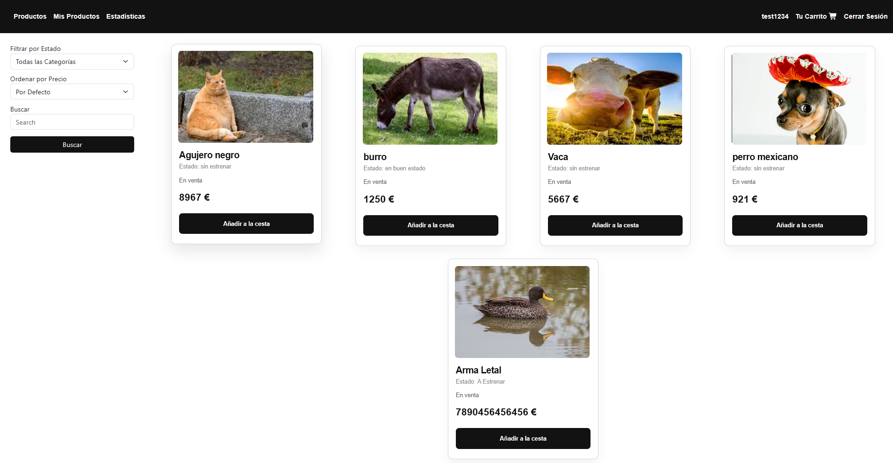

<h1>Proyecto Final de Programación Web</h1>

La página consiste en un Marketplace de segunda mano donde los usuarios pueden comprar y vender sus propios productos.

El marketplace se divide en cuatro sub-páginas:

<ul>
    <li>Página principal donde comprar los productos</li>
    <li> Página con los productos en venta del usuario</li>
    <li>Estadísticas principales de la página</li>
    <li>Carrito de compra con los productos añadidos por el usuario</li>
</ul>

<h3>Productos</h3>

Muestra todos los productos a la venta que no son del usuario. Además permite filtrar por estado del producto, nombre y ordenar por precio.

Cada producto tiene un botón para añadirse al carrito.

<h3>Mis Productos</h3>

Muestra todos los productos del usuario. Permite editar y borrar cada producto, además de la opción de añadir nuevos productos.

<h3>Estadísticas</h3>

Muestra un mapa con las ubicaciones de los usuarios (según los datos introducidos por el usuario en el register) además de un gráfico de sectores que muestra el número de productos en venta y comprados.

<h3>Carrito</h3>

Muestra todos los productos añadidos a la cesta por el usuario en la pestaña de productos. Permite eliminar productos de la cesta y "comprar" los productos.
